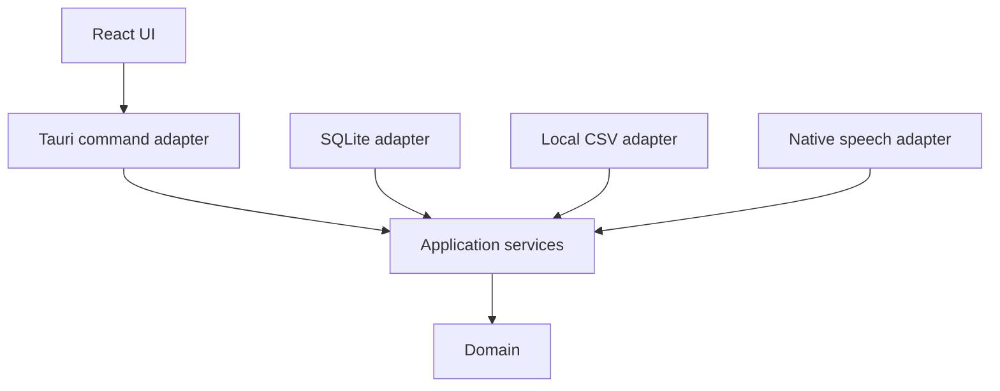

# Architecture

## Scope

The v0.4 foundation provides a desktop-first Tauri application, Polarbear Lexicon, separate content and user databases, quizzes, append-only history, derived collections and statistics, and offline native speech. The v0.8 increment simplifies datasets to a user-defined name plus a set of `sense_uid` values and adds direct transactional CSV import. The v0.9 increment adds English and Simplified Chinese UI resources with an immediately applied, persisted language setting.

## Naming

| Concern | Canonical name |
| --- | --- |
| Product and repository | Polarbear Vocab / `polarbear-vocab` |
| Knowledge-base module | Polarbear Lexicon / `polarbear-lexicon` |
| Rust crate prefix | `polarbear-vocab-*` |
| JavaScript UI package | `@polarbear/vocab-ui` |
| macOS bundle identifier | `com.polarbear.vocab` |

The checkout directory may have a different local name; build and runtime identities use the canonical names above.

## Dependency direction

The domain has no framework or storage dependencies. Application services own use-case orchestration and define infrastructure ports. Adapters translate inputs and outputs only.

## Product boundary

The learning model is based on immutable answer history and generated collections. Scheduler concepts such as due dates, intervals, streaks, mastery, and relearning are intentionally outside the model.

Datasets are stored in the writable local `content.db`. Preloaded and user-created datasets use the same `dataset` and `dataset_item` tables. Vocabulary content uses stable `sense_uid` values, so `user.db` never depends on content-database row IDs. CSV validation happens before import and the complete content update runs in one SQLite transaction.

The app has no catalog, GitHub integration, remote URL importer, dataset marketplace, cloud account, or network TTS. UI language and dataset language are independent; changing the UI language never translates vocabulary content.
